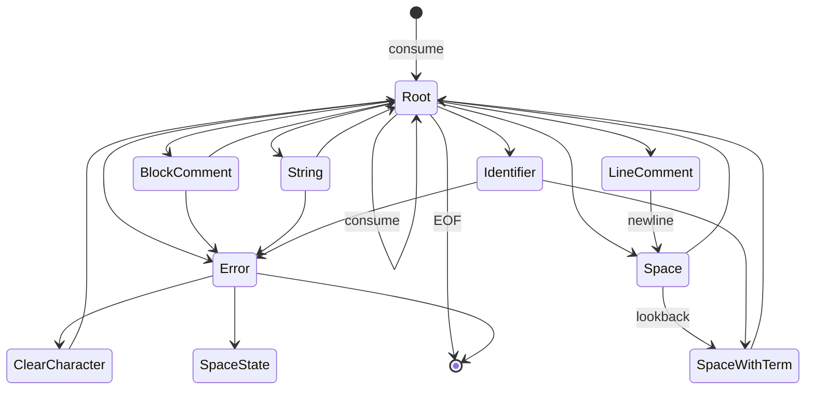

# Lexing State Machine

```mermaid
stateDiagram-v2
    [*] --> Root: consume
    Root --> Root: consume
    Root --> String
    Root --> Error
    Root --> LineComment
    Root --> BlockComment
    Root --> Space
    Root --> Identifier
    Root --> [*]: EOF

    Space --> SpaceWithTerm: lookback
    Space --> Root

    SpaceWithTerm --> Root

    LineComment --> Space: newline

    BlockComment --> Error
    BlockComment --> Root

    String --> Root
    String --> Error

    Identifier --> Error
    Identifier --> SpaceWithTerm

    Error --> ClearCharacter
    Error --> SpaceState
    Error --> [*]

    ClearCharacter --> Root
```